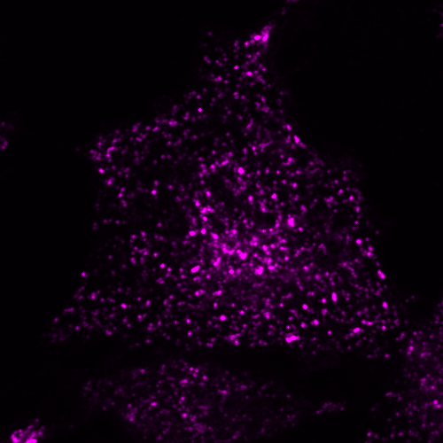

# ImageJ scripts and R code
## Overview
A collection of ImageJ scripts I have put together over the course of my PhD research to help with image analysis. For each one there is an accompanying R script to process and plot the data generated from ImageJ. I have tried to generalise the scripts in the hope they could be useful for other projects. 

[+TIP](##+TIP)

### Data organisation
* A similar directory structure is used for all projects. The parent directory is given the name of the project and contains the subdirectories; `Data`, where the output from ImageJ is located; `Output`, where the dataframes and plots are saved; and `Scripts`, where the ImageJ and R code are located. 
* Within `Data` there are subdirectories containing the ImageJ output from separate experiements, each labelled with their unique experiment number (e.g. JS001). Where there are multiple experiments, a script to combine dataframes from the individual experiments is used.
* Where log.txt is used, analysis was performed blind to the conditions of the experiment and a Lookup.csv is loaded in R to add the original label. 

## Analyse particles
This was initially written to quantify transferrin uptake in cells using images acquired by light microscopy (see below).  

  

### Running the code

* `Analyse_particles.ijm` will _threshold_ the transferrin to isolate vesciular structures and use _analyse particles_ to create a mask of the particles based on parameters set by the user. The output is a csv file containing the results from _analyse particles_ and a txt file containing the values of the _threshold_ limits used for the analysis. Run the script on a directory containing all of the tiff images to be analysed and select a separate directory to output the data. 

* `Analyse_particles.R` will process the `Data` (output from ImageJ) to generate a dataframe, plots and calculate statistics. The dataframe and plots are saved to `Output`. 

## 3D object counter

## +TIP
This was written to process and plot output from *u-track*, a multiple-particle tracking MATLAB software developed by the [Danuser Lab](https://github.com/DanuserLab/u-track). I used this software to detect and track fluorescently-labelled EB3, a microtubule plus-end tracking protein (+TIP), in live-imaging experiments to measure effects on microtubule growth parameters.

## Spindle recruitment

