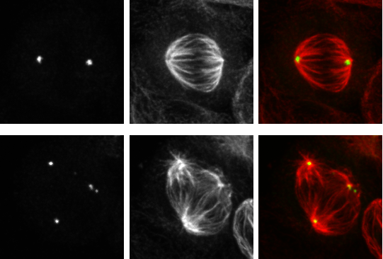
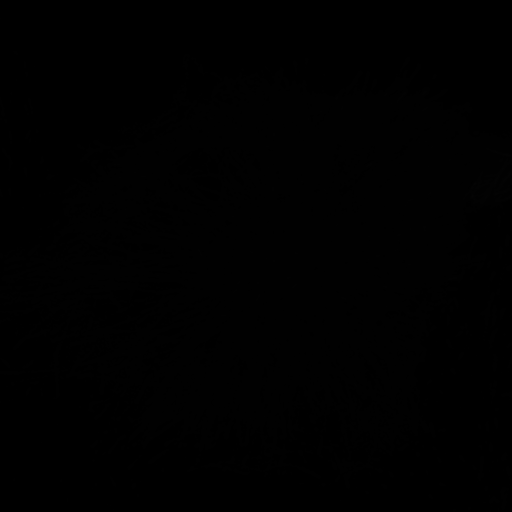

# ImageJ scripts and R code
## Overview
A collection of R scripts I have put together over the course of my PhD research project to process and plot data generated from image analysis performed in ImageJ. For each project, example data and outputs are provided so that the user can run the R scripts and produce the plots. I have tried to generalise the scripts in the hope they could be useful for other projects. 

[Analyse Particles](#analyse-particles) | [3D object counter](#3d-object-counter) | [Microtubule plus-end tracking](#microtubule-plus-end-tracking)

### Data organisation
* A similar directory structure is used for all projects. The parent directory is named according to the project (i.e. `Analyse particles`) and contains the subdirectories; `Data`, where the output from ImageJ, the `lookup.csv` and `log.txt` are located; `Output`, where the dataframes and plots are saved to the directories `Dataframe` and `Plots`, respectively; and `Scripts`, where the ImageJ and R code are located. 
* Within `Data` there are subdirectories containing the ImageJ output from separate experiements, each labelled with their unique experiment number (e.g. `JS103`). 
* Where `log.txt` is used, analysis was performed blind to the conditions of the experiment and a `lookup.csv` is loaded in R to add the original labels. The lookup table is also used to set the levels of the independent variable, enabling the user to change the plotting order by editing the csv file.

### R code
* For each project there is a `Project_name_process.R` script that is used to process the files in the `Data` directory experiment-by-experiment to generate dataframes that are saved to `Output/Dataframe`. The working directory should be set to the parent directory of the project. At the start of the script you will be prompted to select the subdirectory containing the files to be processed, e.g. `Analyse_particles/Data/JS103`. Re-run the script until all experiments in the project have been processed.
* A `Project_name_combined.R` script is used to combine the dataframes from individual experiments, calculate statistics and generate plots that are saved to `Output/Plots`. The working directory should be set to the parent directory. 

## Analyse particles
This was initially written to quantify transferrin uptake in fixed cells using images acquired by light microscopy.  

|  
|:--:|
| *Typical image used to quantify tranferrin uptake (purple spots)* |

### Running the code

* `Analyse_particles.ijm` will _threshold_ the transferrin channel to isolate vesciular structures and use _analyse particles_ to create a mask of the particles based on parameters set by the user. The output is a csv file containing the results from _analyse particles_ and a txt file containing the values of the _threshold_ limits used for the analysis. Run the script on a directory containing all of the tiff images to be analysed and select a separate directory to output the data. 
* `Analyse_particles.R` will process the `Data` (output from ImageJ) to generate a dataframe, plots and calculate statistics. The dataframe and plots are saved to `Output`. 

### Notes

* There is only a single experiment in this project so a `Analyse_particles_combined.R` script is not required.

## 3D object counter
This was written to detect and measure objects in z-stack images acquired by confocal microscopy. The example provided here detects and measures pericentrin (centrosome marker) in images of HeLa cells fixed in metaphase. 

|  
|:--:|
| *Example micrographs of HeLa cells fixed in metaphase to visualise pericentrin (green) and tubulin (red)* |

### Running the code

* `3D_object_count.ijm` will require the user to draw around the outline of the cell to be analysed and use _3D Objects Counter_ to measure the objects in the image. The output is a csv file containing the measurements and a txt file containing the size filter and threshold limits used in _3D Objects Counter_ as set by the user. Run the script on a directory containing all of the tiff images to be analysed and select a separate directory to output the data to.
* `3D_Object_Count.R` will process the `Data` (output from ImageJ) for each experiment and generate a dataframe that is saved to `Output/Dataframe`. 
* `3D_object_count_combined.R` will combine the dataframes generated in the previous script and produce plots that are saved to `Output/Plots`.

## Microtubule plus-end tracking
I wrote an R script to process and plot output from *u-track*, a multiple-particle tracking MATLAB software developed by the [Danuser Lab](https://github.com/DanuserLab/u-track). I used this software to detect and track fluorescently-labelled EB3 (a microtubule plus-end tracking protein, (+TIP)) in  movies taken from live-cell imaging experiments, to measure microtubule growth parameters under different conditions.

| 
|:--:|
| *Still image of growing microtubles in a cell expressing fluorescently-labelled EB3* |

### Running the code
* `Microtubule_tracking.R` will process the `Data` (output from *u-track*) for each experiment and generate a dataframe that is saved to `Output/Dataframe`. 
* `Microtubule_tracking_combined.R` will combine the dataframes, calculate statistics and generate plots. Plots are saved to `Output/Plots`.

### Notes
* The organisation of `Data` is slightly different to the other projects in that there are multiple subdirectories and the analysis was not performed 'blind'. This is because the analysis was performed using the MATLAB based software *u-track*, which is an automated particle tracking software. The output from *u-track* includes mat files in addition to the txt file used here for processing. The mat files were removed from the `Data` directory here for simplicity. 
